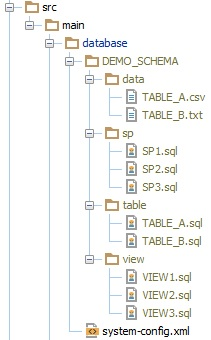

# What is Obevo?

(i.e. a short version of [this InfoQ article](https://www.infoq.com/articles/Obevo-Introduction))

Obevo is a tool for database deployment that makes it easy to manage your
database files, deploy to production, and test your database scripts.

It is built to handle enterprise scale and complexity (hundreds or even
thousands of database objects per schema).

Obevo's distinguishing feature is the ability to maintain database objects
in a object-per-file basis while still allowing for an elegant ordering
mechanism that can scale for large use cases.

# Typical Database Deployment Example

Let's start with a simple example: a schema with a few tables, views,
and stored procedures.

Using a manual deployment procedure or with other typical tools, these
objects would have been deployed via some incremental change script, e.g.

* v1_initial_tables.ddl: creates TABLE_A, TABLE_B, DYN_TABLE_C
* v2_create_views: creates VIEW1, VIEW2
* v3_mod_a: modifies TABLE_A, VIEW2
* v4_more_views: creates VIEW3, VIEW4, DYN_TABLE_D, modifies TABLE_B
* and so on ...

Obviously there are many ways the changes could be organized, but there
are two key factors that characterize how the changes are maintained:

1. The order of deployment is based on the file ordering convention for
the deployment tool.
2. Each file could account for changes to multiple objects.

Deployment tools will typically work similar to a commit log:
* Record the changes that get deployed to the audit log
* On the next deployment, only deploy those changes that aren't already
in the audit log

## What problems can arise from this?

For a handful of database objects, the setup above may suffice. But what
about for hundreds or thousands of objects over many years?

Some inconvencies that can arise:

* Incremental files will build up over time, making the codebase harder to maintain
* Object definitions are interspersed across multiple files:

* If we try the object-per-file format earlier, there is no clear way to order the changes

# Innovations of Obevo

1) Our deployment algorithm can handle ordering hundreds of objects by
leveraging topological sorting.

We can easily parse the dependencies of an object using a simple text-based
search.

Note - this algorithm is agnostic of the underlying implementation type.
It does not have to be a SQL-based RDBMS; in fact, MongoDB support was
added recently.

Hence, it becomes very easy to maintain your database code in a developer-friendly
manner while still being able to deploy incrementally to production and
fully to a test database.

2) Obevo is designed to ease onboarding of existing clients. We've
extensively worked on the reverse-engineering capabilities from the
databases (relying on the DBMS's own tooling) to ensure that anyone can
onboard.

Our aim is to give hope to any team that wants to fix their database
SDLC, regardless of how old or complex their system is.

3) We allow clients to test their SQL logic via in-memory databases (e.g.
HSQLDB, H2) even if their SQL code is written in another vendor's SQL
dialect.

We achieve this with our translation logic, which relies on AST parsing,
native functionality from the in-memory DB, and regular expressions.

# Contributing to Obevo

There are different themes that someone can address when contributing to
Obevo.

1) Core deployent engine: as mentioned earlier, the core deploy logic
and ordering algorithm is the heart of what makes Obevo work. There are
still fixes and improvements that can be done along those lines.

2) Database integration and reverse engineering: If all databases
implemented the same SQL in exactly the same way with the same database
structures, then we'd have no need to accept contributions from developers
to help with this. Alas, that is not the case :)

Whether it is adding support for new DBMS types or refining logic on
existing ones, we have things to do here. The work typically spans
handling deployments for new systems or adding reverse-engineering logic.

(We do leverage the awesome [SchemaCrawler](http://www.schemacrawler.com)
library to help with consistent coding across DBMS types.)

3) Unit test translations: today, we only support translations from
DB2 or Sybase ASE to HSQLDB or H2. We haven't been asked for more use cases
(both on the "from" side and the "to" side), but they can come.

We also have integrations with ORM tooling such as Hibernate and Reladomo,
i.e. to take in the DB schemas generated by their object models for testing.

4) Integration with other deployment APIs: Obevo provides a simple API
to invoke deployments, the goal being to make it as easy to integrate
into other SDLC tooling as possible.

Currently, we have a command-line API and a Maven plugin. More integrations,
such as a native Gradle plugin, Terraform plugin, or integration with
DropWizard would be nice to have, along with any idea you can think of.

# Quick walk through of katas

See [Kata Home Page](/)

# Suggested Issues

See [Obevo Issues Page](https://github.com/goldmansachs/obevo/issues)

Look for the label "good first issue" to start with.

You can also look into the "help wanted - small" and
"help wanted - medium" if you feel you are ready for those.

# Developer Guide

Link [here](https://goldmansachs.github.io/obevo/developer-guide.html)
