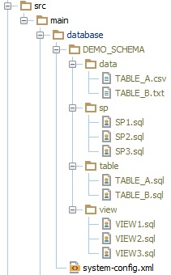

<!--

    Copyright 2017 Goldman Sachs.
    Licensed under the Apache License, Version 2.0 (the "License");
    you may not use this file except in compliance with the License.
    You may obtain a copy of the License at

        http://www.apache.org/licenses/LICENSE-2.0

    Unless required by applicable law or agreed to in writing,
    software distributed under the License is distributed on an
    "AS IS" BASIS, WITHOUT WARRANTIES OR CONDITIONS OF ANY
    KIND, either express or implied.  See the License for the
    specific language governing permissions and limitations
    under the License.

-->

# Kata Setup


#### 1) Setup Java (Java 7 minimum)

Link to [JDK downloads](http://www.oracle.com/technetwork/java/javase/overview/java8-2100321.html)


#### 2) Download Obevo
Download the binary from either:
* [Obevo Release page](https://github.com/goldmansachs/obevo/releases/latest)
* Or [this direct link](https://github.com/goldmansachs/obevo/releases/download/6.4.0/obevo-cli-6.4.0-dist.zip)


#### 3) Checkout the kata code
From the [Kata Github project](https://github.com/goldmansachs/obevo-kata)

```
git clone https://github.com/goldmansachs/obevo-kata.git
```


#### 4) Setup the environment variables for the kata
(Not technically required for Obevo's normal execution, but highly recommended for convenience for these exercises)

* OBEVO_HOME for the location of the binary that you unzipped
* KATA_HOME for the location of the kata project that you checked out

```
@REM In Windows
SET OBEVO_HOME=H:\obevo
SET KATA_HOME=H:\obevo-checkout\database-kata
```

```
# In Linux/Bash
export OBEVO_HOME=/home/myuser/obevo
export KATA_HOME=/home/myuser/obevo-checkout/database-kata
```


The scripts will be run at %OBEVO_HOME%\bin (Windows) a.k.a. $OBEVO_HOME/bin (Linux/Bash)

For the rest of this kata, we will use the Windows convention when writing the commands.


#### 5) Run the initial setup command for your files
This step would simulate you creating a database w/ tables, views, data, etc.

```
@REM In Windows
%KATA_HOME%\kata-files\lesson1\kata-step1.bat
```

```
# In Linux/Bash
$KATA_HOME/kata-files/lesson1/kata-step1.sh
```

Your setup should look like this:




#### 6) (Optional) Setup Maven to try out the JUnit test and Maven plugin
(If you are already familiar with Maven setup, you can ignore this section)

In this kata, we also demonstrate how to use Obevo in a unit test and to run a test deployment as part of your build.

For that, you will need Maven, which you can download from [here](https://archive.apache.org/dist/maven/maven-3/3.5.0/binaries/apache-maven-3.5.0-bin.zip)


#### 7) Understand the files in your project
Files you should ignore:
* /internal/:  files for the Obevo developers to test out the kata in the continuous build
* LICENSE.txt, NOTICE.txt: files required for Apache licensed projects
* kata.md, README.md: documentation files for this kata
* .travis.yml: meant only for the Kata's own continuous build that the Obevo team maintains

Files you will use for the kata:
* kata-files/setup/: We will setup a local HSQLDB instance for this kata. The binaries and scripts for that are in this folder
* src/main/database/: Your DB system will be defined in here for the kata. The kata checkout starts with only system-config.xml. You will add more files from...
* kata-files/lesson*/: These folders contain scripts needed during your kata lessons.
* src/test/java: We show an example here of how to use Obevo in your unit tests.
* pom.xml: standard pom for your project

You can use the kata files as templates for your own project; though for the pom.xml, you should ignore the &lt;profiles&gt;
section, as that is meant only for the Kata's own continuous build that the Obevo team maintains.


#### 8) Setup the test HSQLDB database

To demo the tool, we need a database against which to run our scripts.

While you are free to try this against your own database, we provide an HSQLDB demo so that you can get this setup quickly without any external dependencies.


Step 1: start the HSQLDB server. This will open up the server on port 9092

```
@REM In Windows
%KATA_HOME%\kata-files\setup\startDb.bat
```

```
# In Linux/Bash
$KATA_HOME/kata-files/setup/startDb.sh
```

Step 2: setup the environment (e.g. schemas, users). This will also create a user with id=katadeployer and
password=katadeploypass for you to use

```
@REM In Windows
%KATA_HOME%\kata-files\setup\initDb.bat
```

```
# In Linux/Bash
$KATA_HOME/kata-files/setup/initDb.sh
```

In case you need to stop the DB:

```
@REM In Windows
%KATA_HOME%\kata-files\setup\shutdownDb.bat
```

```
# In Linux/Bash
$KATA_HOME/kata-files/setup/shutdownDb.sh
```


#### Viewing the DB:
To view the DB state, you can either:

A) Use our provided script to start HSQLDB's own DatabaseManager tool to view the DB.

The script already is configured by default to connect to the example server.

```
@REM In Windows
%KATA_HOME%\kata-files\setup\dbviewer.bat
```

```
# In Linux/Bash
$KATA_HOME/kata-files/setup/dbviewer.sh
```

B) Use any DB viewer tool that you'd like with the following information.

* User/password is deployer/deploypass
* URL is jdbc:hsqldb:hsql://localhost:9092/obevokata
* Driver is org.hsqldb.jdbc.JDBCDriver
* Driver jar is available at kata-files/setup/hsqldb-2.3.4.jar


#### Start the Kata:

You are now ready to try the kata!

Choose one of the lessons from the [Home Page](/README.md) to begin.
